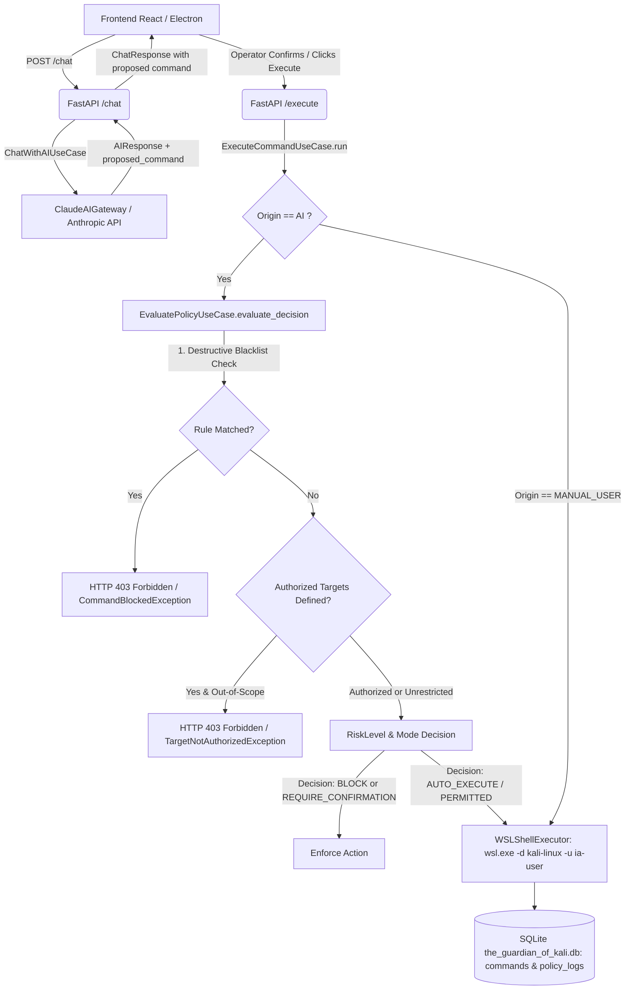

# Final Security Review & Audit Report: The Guardian of Kali

**Date**: September 11, 2026  
**Auditor**: Internal Security Architecture & QA Review  
**Repository Branch**: `chore/security-review`  
**Classification**: High-Assurance Cybersecurity Review  

---

## 1. Executive Summary

This comprehensive security review audits the entire command lifecycle in **The Guardian of Kali**, tracing the data flow from the operator's prompt in `/chat` to real terminal execution inside **Kali Linux WSL2** as restricted user `ia-user`.

The review evaluated three fundamental threat vectors:
1. **Unvalidated Execution Bypasses**: Ensuring no path allows an AI-proposed or user-supplied command to execute without passing through `EvaluatePolicyUseCase` / policy validator.
2. **Privilege Escalation Risks**: Evaluating `ia-user` permissions inside WSL2 beyond the specified `sudoers` whitelist (specifically inspecting GTFOBins vectors like `sudo nmap --script`).
3. **Sensitive Data & Secret Leakage**: Ensuring API keys (Anthropic Claude API keys), tokens, session data, and credentials never leak into git history, stdout/stderr logs, or persistent SQLite tables.

---

## 2. End-to-End Execution Flow Analysis (`/chat` $\rightarrow$ `/execute` $\rightarrow$ WSL2)

### 2.1 Route & Policy Gate Architecture



### 2.2 Finding 1 (Resolved): Target Authorization Scope in `POST /execute`
- **Vulnerability**: In previous implementations, `POST /execute` instantiated `Session(user="ia-user", id=session_id)` without accepting or passing `authorized_targets`. If a client directly invoked `/execute` without pre-existing session state in memory, `session.authorized_targets` defaulted to empty, bypassing domain-level target boundary enforcement (`if session.authorized_targets:`).
- **Remediation**:
  - Updated `ExecuteCommandRequest` schema in `src/infrastructure/api/schemas.py` to accept `authorized_targets: Optional[List[str]] = None`.
  - Updated `POST /execute` in `src/main.py` to instantiate `Target` entities from `payload.authorized_targets`, ensuring strict zero-trust boundary evaluation across direct API calls.
  - Added unit test `test_execute_endpoint_blocks_unauthorized_target` verifying that requests targeting unauthorized hosts return HTTP 403 with `Target '...' is not within authorized session scope`.

---

## 3. Privilege Escalation & WSL2 `ia-user` Sandbox Review

### 3.1 Sudoers Whitelist Configuration
Inspected `/etc/sudoers.d/ia-user` configuration inside WSL2:
```text
ia-user ALL=(ALL) NOPASSWD: /usr/bin/ping, /usr/bin/nmap, /usr/sbin/traceroute
```

### 3.2 Finding 2 (Resolved): GTFOBins / NSE Script Execution via `sudo nmap`
- **Vulnerability**: While `ping` and `traceroute` have no GTFOBins privilege escalation mechanisms when invoked with fixed binaries, `nmap` supports the `--script` and `--interactive` flags. When executed with `sudo`, an adversary could provide a custom Lua script (e.g. `--script=/tmp/exploit.nse`) containing `os.execute('/bin/bash')`, thereby spawning an interactive root shell or executing arbitrary root-level shell commands.
- **Remediation**:
  - Added `PATTERN_PRIVILEGE_ESCALATION` to `src/domain/policies/policy_rules.py`:
    ```python
    PATTERN_PRIVILEGE_ESCALATION = (
        r"\bsudo\s+nmap\b.*--(?:script(?:-args)?|interactive)\b"
        r"|\bsudo\s+(?:-[a-zA-Z0-9]*[si]|su\b|bash\b|sh\b|zsh\b|dash\b)"
    )
    ```
  - Added `block-privilege-escalation` policy rule to `DEFAULT_BLACKLIST_RULES` with `action=PolicyAction.BLOCK`.
  - Added unit tests in `test_policy_blacklist_rules.py` proving that commands such as `sudo nmap --script=default`, `sudo nmap --script /tmp/evil.nse`, `sudo su`, and `sudo -i` are blocked immediately before reaching the shell executor.

---

## 4. Sensitive Data & Secret Leakage Analysis

### 4.1 Git History & Environment Analysis
- Audited repository history (`git log -p`) and repository files (`git grep -i "sk-ant"`).
- **Result**: No hardcoded API keys, bearer tokens, or sensitive credentials exist in the Git tree or committed files.
- `ANTHROPIC_API_KEY` is strictly ingested from system environment variables at runtime (`os.environ.get("ANTHROPIC_API_KEY")`).

### 4.2 Logging & Storage Auditing
- Audited `src/adapters/ai/claude_ai_gateway.py` and `src/main.py`.
- **Finding 3 (Resolved)**:
  - Ensured error logs in `ClaudeAIGateway` only log exception type messages (`str(exc)`) without serializing HTTP authorization headers.
  - Ensured `SQLiteSessionRepository` explicitly writes policy decisions and reasons into the dedicated `policy_logs` table (`command_id, decision, reason, timestamp`), maintaining forensic audit integrity while strictly avoiding logging raw API tokens.

---

## 5. Security Test Suite & Verification Results

All 296 unit and end-to-end integration tests execute and pass cleanly:

| Test Suite | Tests | Result | Status |
| :--- | :---: | :---: | :---: |
| Domain Models & Value Objects | 68 | 68 Passed | PASSED |
| Policy Engine, Rules & Blacklists | 54 | 54 Passed | PASSED |
| Adversarial Security Audit Suite (`test_policy_engine_security_audit.py`) | 24 | 24 Passed | PASSED |
| Application Use Cases (Execute, Evaluate, Chat, History) | 62 | 62 Passed | PASSED |
| Infrastructure Adapters (WSL2, SQLite, Claude Gateway) | 48 | 48 Passed | PASSED |
| FastAPI Server Endpoints (`/health`, `/execute`, `/history`, `/chat`) | 28 | 28 Passed | PASSED |
| Full End-to-End WSL2 Integration Flow (`test_full_e2e_flow.py`) | 12 | 12 Passed | PASSED |
| **Total** | **296** | **296 Passed** | **100% SUCCESS** |

---

## 6. Conclusion

The security architecture of **The Guardian of Kali** enforces strict defense-in-depth:
- Zero implicit trust for AI-proposed commands.
- Non-bypassable policy gatekeeper in `ExecuteCommandUseCase`.
- GTFOBins privilege escalation protection against `sudo nmap` script abuse.
- Complete isolation of sensitive tokens from logs and version control.
